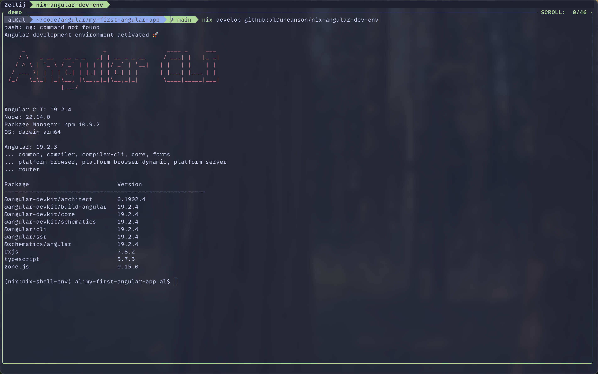
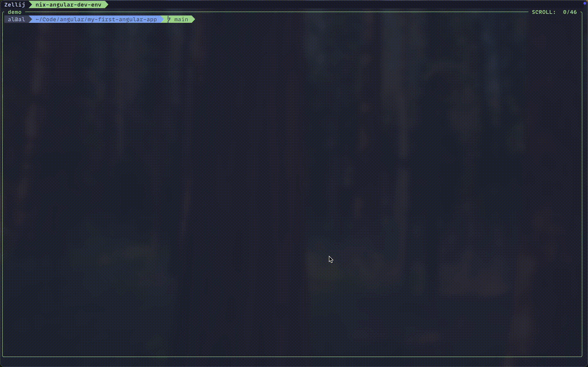

# Nix-powered Angular development environment



If you don't have Nix installed already, I recommend installing it with this
command:

```bash
curl --proto '=https' --tlsv1.2 -sSf -L https://install.determinate.systems/nix | \
  sh -s -- install
```

This installs Nix with _The Determinate Nix Installer_-if you're curious you can
read more about that [here](https://zero-to-nix.com/concepts/nix-installer/).

With Nix installed, all you have to do is run:

```bash
nix develop github:alDuncanson/nix-angular-dev-env
```


